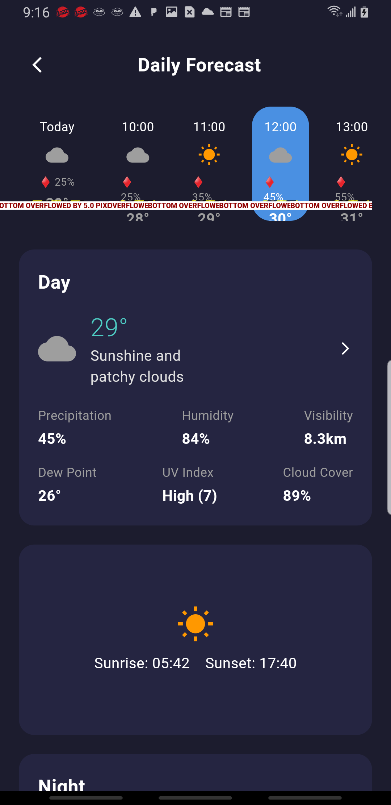

# ⛅ Sky Cast - Advanced Weather Forecasting App

<div align="center">
  
</div>

**Sky Cast** is a comprehensive weather forecasting mobile application built with Flutter, designed to provide accurate, real-time weather information with a beautiful and intuitive user interface. The app combines multiple weather data sources to deliver precise forecasts, interactive weather maps, and personalized weather insights.

## 📋 Project Overview

This full-featured weather application delivers a complete meteorological experience with:

- **Real-time Weather Data**: Live weather conditions with automatic location detection
- **Extended Forecasting**: Detailed 7-day and hourly weather predictions
- **Interactive Weather Animations**: Beautiful Lottie animations for different weather conditions
- **Location Management**: Multiple location tracking with favorites system
- **Weather Analytics**: Visual charts and graphs for weather trends
- **Personalized Experience**: Customizable interface with weather-based themes

Built with Flutter's cross-platform capabilities and integrated with OpenWeatherMap API, Sky Cast provides accurate weather information in a visually appealing and user-friendly interface.

## ✨ Key Features

### 🌍 Location & Detection
- **Auto Location Detection**: GPS-based current location weather using Geolocator
- **Multiple Locations**: Save and monitor weather for multiple cities
- **Location Search**: Intelligent city and location search functionality
- **Favorites Management**: Quick access to frequently checked locations
- **Global Coverage**: Weather data for locations worldwide

### 🌤️ Current Weather Display
- **Real-time Conditions**: Current temperature, humidity, wind speed
- **Feels Like Temperature**: Heat index and wind chill calculations
- **Animated Weather Icons**: Dynamic Lottie animations for weather conditions
- **Sunrise/Sunset Times**: Daily solar information with precise timing
- **UV Index**: Sun exposure safety recommendations
- **Visibility & Pressure**: Atmospheric condition details
- **Dew Point**: Advanced meteorological calculations

### 📅 Detailed Forecasting
- **7-Day Forecast**: Extended weather predictions with daily highs/lows
- **Hourly Forecast**: 24-hour detailed weather progression
- **Precipitation Probability**: Rain and snow chance percentages
- **Temperature Trends**: Visual temperature variation with FL Chart
- **Weather Patterns**: Detailed condition descriptions and advice

### 📊 Weather Analytics & Visualization
- **Interactive Charts**: Temperature and precipitation graphs using FL Chart
- **Weather Statistics**: Historical weather trends and comparisons
- **Visual Data Representation**: Beautiful charts for weather patterns
- **Smooth Animations**: Flutter Animate for enhanced user experience

### 🎨 User Experience
- **Dynamic Themes**: Weather-responsive background and color schemes using Flex Color Scheme
- **Animated Backgrounds**: Beautiful Lottie weather condition animations
- **Intuitive Navigation**: Easy-to-use interface with Go Router navigation
- **Dark Mode Support**: Optimized dark theme for better visibility
- **Google Fonts Integration**: Beautiful typography with Google Fonts
- **Multilingual Support**: Internationalization with Easy Localization

### 🔄 Data Management
- **Provider State Management**: Efficient state management with Provider pattern
- **HTTP Integration**: Reliable API communication with error handling
- **JSON Serialization**: Advanced weather data parsing with JSON Annotation
- **Cached Data**: Optimized image caching with Cached Network Image
- **Environment Variables**: Secure API key management with Flutter DotEnv

## 🛠 Technical Stack

### Frontend Framework
- **Flutter**: Cross-platform mobile app development (SDK ^3.8.1)
- **Dart**: Modern programming language for Flutter
- **Material Design**: Google's design system with custom weather themes

### Weather APIs & Data Sources
- **OpenWeatherMap API**: Primary weather data provider
- **Geocoding API**: Location search and coordinate conversion
- **UV Index API**: Sun exposure and safety information

### State Management & Architecture
- **Provider (^6.0.0)**: State management for reactive weather updates
- **HTTP (^1.2.0)**: API communication with error handling
- **JSON Annotation (^4.8.1)**: Weather data parsing and management
- **Equatable (^2.0.5)**: Object comparison and state management

### UI/UX Components
- **Lottie (^3.1.0)**: Weather-specific animated iconography
- **FL Chart (^0.65.0)**: Interactive weather charts and graphs
- **Flutter Animate (^4.2.0)**: Smooth animations and transitions
- **Flex Color Scheme (^7.3.1)**: Dynamic weather-based color schemes
- **Google Fonts (^6.1.0)**: Beautiful typography integration
- **Flutter SVG (^2.0.9)**: Vector graphics support
- **Smooth Page Indicator (^1.1.0)**: Page navigation indicators

### Device Integration & Utilities
- **Geolocator (^10.1.0)**: GPS location detection and updates
- **Permission Handler (^11.0.1)**: Location and device permissions
- **Go Router (^13.0.0)**: Advanced navigation and routing
- **Easy Localization (^3.0.3)**: Internationalization support
- **Share Plus (^7.2.1)**: Social sharing functionality
- **Intl (^0.20.1)**: Date and number formatting

### Development Tools
- **Build Runner (^2.4.6)**: Code generation and building
- **JSON Serializable (^6.7.1)**: Automatic JSON serialization
- **Flutter Lints (^5.0.0)**: Code quality and best practices

## 📱 App Architecture

### Screen Structure
- **Home Screen**: Main weather dashboard with current conditions
- **Forecast Screen**: Extended weather forecasts and predictions
- **Location Screen**: Location management and search
- **Daily Forecast Screen**: Detailed daily weather breakdown
- **Menu Screen**: App navigation and settings access
- **Settings Screen**: App preferences and customization
- **Splash Screen**: Beautiful app loading experience

### Weather Animations
The app includes beautiful Lottie animations for different weather conditions:
- ☀️ **Sunny**: Bright and cheerful sunny weather animation
- ⛅ **Partly Cloudy**: Mixed sun and cloud animations
- ☁️ **Cloudy**: Overcast and cloudy weather effects
- 🌧️ **Rainy**: Rain droplets and precipitation animations
- ⛈️ **Thunder**: Lightning and thunderstorm effects
- ❄️ **Snow**: Snowfall and winter weather animations
- 🌫️ **Mist**: Fog and misty weather conditions

## 🚀 Installation & Setup

### Prerequisites
- Flutter SDK (^3.8.1)
- Dart SDK
- Android Studio / Xcode
- OpenWeatherMap API key
- Internet connection for weather data

### Installation Steps

1. **Clone the Repository**
   ```bash
   git clone https://github.com/NaeemAkmal/skycast.git
   cd skycast
   ```

2. **Install Dependencies**
   ```bash
   flutter pub get
   ```

3. **API Configuration**
   - Sign up for OpenWeatherMap API: [OpenWeatherMap API](https://openweathermap.org/api)
   - Create `.env` file in project root:
     ```env
     OPENWEATHER_API_KEY=your_openweathermap_api_key_here
     ```
   - Update `lib/core/constants.dart` with your API key:
     ```dart
     const String apiKey = 'your_openweathermap_api_key';
     ```

4. **Permissions Setup**
   - **Android** (`android/app/src/main/AndroidManifest.xml`):
     ```xml
     <uses-permission android:name="android.permission.INTERNET" />
     <uses-permission android:name="android.permission.ACCESS_FINE_LOCATION" />
     <uses-permission android:name="android.permission.ACCESS_COARSE_LOCATION" />
     ```
   - **iOS** (`ios/Runner/Info.plist`):
     ```xml
     <key>NSLocationWhenInUseUsageDescription</key>
     <string>Sky Cast needs location access to provide accurate weather forecasts</string>
     ```

5. **Run the Application**
   ```bash
   flutter run
   ```

## 📁 Project Architecture

```
lib/
├── main.dart                          # App entry point with providers
├── app.dart                           # App configuration and routing
├── core/                              # Core app configuration
│   ├── constants.dart                 # API keys and constants
│   ├── env.dart                       # Environment variables
│   └── theme.dart                     # App themes and styling
├── models/                            # Data models
│   ├── weather.dart                   # Weather data model
│   ├── forecast.dart                  # Weather forecast model
│   └── city.dart                      # Location and city model
├── providers/                         # State management
│   ├── weather_provider.dart          # Weather state management
│   ├── city_provider.dart             # Location state management
│   └── theme_provider.dart            # Theme and UI state
├── services/                          # API and external services
│   ├── weather_service.dart           # OpenWeatherMap API integration
│   ├── alternative_weather_service.dart # Backup weather service
│   ├── location_service.dart          # GPS and location services
│   └── favorites_service.dart         # Favorites management
├── screens/                           # UI screens
│   ├── home_screen.dart               # Main weather dashboard
│   ├── forecast_screen.dart           # Extended weather forecasts
│   ├── daily_forecast_screen.dart     # Daily weather details
│   ├── location_screen.dart           # Location management
│   ├── menu_screen.dart               # App navigation menu
│   ├── settings_screen.dart           # App settings and preferences
│   └── splash_screen.dart             # App loading screen
├── widgets/                           # Reusable UI components
│   ├── city_list_item.dart            # Location list items
│   ├── search_city_dialog_fixed.dart  # Location search dialog
│   └── search_city_dialog_backup.dart # Backup search functionality
├── data/                              # Static data and databases
│   └── cities_database.dart           # Cities and locations database
└── utils/                             # Utility functions
    ├── date_utils.dart                # Date and time formatting
    └── weather_utils.dart             # Weather calculation utilities
```

### Assets Structure
```
assets/
└── lottie/                            # Weather animations
    ├── sunny.json                     # Sunny weather animation
    ├── partly_cloudy.json             # Partly cloudy animation
    ├── cloudy.json                    # Cloudy weather animation
    ├── rainy.json                     # Rain animation
    ├── thunder.json                   # Thunderstorm animation
    ├── snow.json                      # Snow animation
    └── mist.json                      # Mist/fog animation
```

## 🌟 Core Features Implementation

### Weather Data Processing
- **OpenWeatherMap Integration**: Primary weather API with comprehensive data
- **Data Validation**: Error handling and data quality checks
- **Real-time Updates**: Automatic weather data refresh
- **Advanced Calculations**: Dew point, feels-like temperature algorithms

### Location Services
- **GPS Integration**: Automatic current location detection with Geolocator
- **Permission Handling**: Secure location access with Permission Handler
- **Location Search**: Intelligent city and place name search
- **Favorites System**: Save and manage frequently checked locations

### User Interface Design
- **Dynamic Theming**: Weather-responsive color schemes with Flex Color Scheme
- **Animated Elements**: Smooth transitions with Flutter Animate
- **Lottie Animations**: Weather-specific beautiful animations
- **Responsive Layout**: Optimized for different screen sizes
- **Dark Mode**: Optimized dark theme for better visibility

## 🔒 Privacy & Security

- **Location Privacy**: Optional location sharing with user consent
- **Data Encryption**: Secure storage of user preferences and locations
- **API Security**: Secure API key management with environment variables
- **Permission Management**: Transparent location permission requests
- **Offline Support**: Cached data for limited offline functionality

## 🚀 Performance Optimizations

- **Efficient State Management**: Provider pattern for optimal performance
- **Image Caching**: Optimized image loading with Cached Network Image
- **API Rate Limiting**: Intelligent API call management
- **Memory Management**: Proper disposal of resources and animations
- **Build Optimization**: Tree shaking and code splitting

## 🗺 Development Roadmap

### Phase 1: Core Features ✅
- [x] Current weather display with animations
- [x] Location detection and management
- [x] 7-day weather forecasting
- [x] Beautiful UI with dark theme
- [x] OpenWeatherMap API integration

### Phase 2: Enhanced Features
- [ ] Weather alerts and notifications
- [ ] Interactive weather maps
- [ ] Historical weather data
- [ ] Weather widgets for home screen
- [ ] Social sharing enhancements

### Phase 3: Advanced Features
- [ ] Weather radar integration
- [ ] Air quality index
- [ ] Pollen count information
- [ ] Weather-based recommendations
- [ ] Multi-language expansion

### Phase 4: Platform Expansion
- [ ] iOS platform optimization
- [ ] Web platform support
- [ ] Desktop application
- [ ] Apple Watch companion
- [ ] Android Wear integration

## 🐛 Known Issues & Limitations

- API rate limits may affect frequent updates
- GPS accuracy depends on device capabilities
- Some weather animations may impact battery usage
- Offline functionality is limited without internet connection
- Location search requires active internet connection

## 🤝 Contributing

We welcome contributions to Sky Cast! Here's how you can help:

### Getting Started
1. Fork the repository
2. Create a feature branch: `git checkout -b feature/amazing-feature`
3. Make your changes following our coding standards
4. Write tests for new functionality
5. Commit your changes: `git commit -m 'Add amazing feature'`
6. Push to your branch: `git push origin feature/amazing-feature`
7. Submit a pull request

### Development Guidelines
- Follow Flutter/Dart best practices and conventions
- Write clear, commented code with meaningful variable names
- Implement proper error handling and user feedback
- Add unit tests for business logic
- Update documentation for new features
- Ensure responsive design for different screen sizes

### Code Style
- Use `dart format` for code formatting
- Follow Flutter's official style guide
- Use meaningful commit messages
- Keep functions small and focused
- Comment complex weather calculations

## 📄 License

This project is licensed under the MIT License - see the [LICENSE](LICENSE) file for details.

## 👨‍💻 Author

**Naeem Akmal** - *Lead Developer*
- GitHub: [@NaeemAkmal](https://github.com/NaeemAkmal)
- Email: naeemakmaltts15@gmail.com
- LinkedIn: [Naeem Akmal](https://www.linkedin.com/in/naeem-akmal-483282306/)

## 🙏 Acknowledgments

- **Flutter Team** - For the amazing cross-platform framework
- **OpenWeatherMap** - For reliable weather data API
- **Lottie Team** - For beautiful weather animations
- **Material Design** - For the beautiful design system
- **Open Source Community** - For the incredible packages and libraries

## 📞 Support & Contact

For support, questions, or collaboration opportunities:

- **Email**: naeemakmaltts15@gmail.com
- **GitHub Issues**: [Create an Issue](https://github.com/NaeemAkmal/skycast/issues)
- **Discussions**: [GitHub Discussions](https://github.com/NaeemAkmal/skycast/discussions)

## 📊 Project Stats

- **Development Time**: 2+ months
- **Lines of Code**: 5,000+
- **Features Implemented**: 20+
- **Weather Animations**: 7 unique Lottie animations
- **Screens**: 8+ comprehensive screens
- **API Integrations**: OpenWeatherMap with backup services

---

<div align="center">
  <p><strong>Built with ❤️ using Flutter & OpenWeatherMap API</strong></p>
  <p><em>Sky Cast - Your Weather, Beautifully Crafted</em></p>
  <p>⭐ Star this repo if you found it helpful!</p>
</div>
